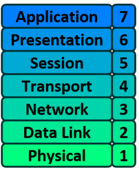

Dato: 09/24/2026

# Packet Traveling

Målet med dette er å forstå hvordan nettverkskommunikasjon henger sammen.   
Det jeg ønsker og åpne med dette er å skape en modell eller ett kart over hvordan datamaskiner og nettverk kommuniserer. 

Jeg ønsker og kunne se på nettverksdiagrammer og mentalt se for meg hvordan ting henger sammen og beveger seg, på samme måte som jeg leser en plantegning eller teknisk tegning av et bygg.  

### Hvordan beveger packets seg gjennom internettet. 

Hvordan kommer data fra én maskin til en annen?

## OSI Modell: 

OSI-Modellen er delt i 7 deler, der hver del har spesifikk funksjon som den skal utføre. 
Når man kombinerer alle disse 7 delene sammen, så bidrar hver funksjon til å kunne veksle data / kommunisere mellom datamaskiner.

  
*Figure 1: OSI Modell. Source: [Practicalnetworking](https://www.practicalnetworking.net/series/packet-traveling/osi-model/)*

### OSI Layer 1 - Physical: 
Det denne delen av OSI modellen har ansvar over å sende bits 1 og 0 som lager alt data koder. 
Ett eksempel på dette er da en **Ethernet-kabel** 

Ikke heng deg opp i ordet physical fordi, dette ble laget på 1970 tallet. Lenge før trådløs kommunikasjon i networking var ett konsept.
Wi-fi f.eks, har ikke noe kabler eller fysysike komponenter som kobler Data 1 til Data 2. Men, er fortsatt beregent som en del av Layer 1. 
En hub opererer også på dette nivået. 

### OSI Layer 2 - Data Link: 
Data link laget sin jobb er å kommunisere med Layer 1(Physical Layer)

Den har som ett ansvar for å sende ut 1 og 0 ut til kablene og hente ut 1 og 0 fra kablene.

Nettverkskortet (NIC) i min datamaskin, der jeg setter inn ethernet kabelen min inn håndtere funksjonalitet til Layer 2.  
Den mottar signaler fra kablene og sender signaler tilbake til kablene. 

Wi-fi Nettverkskortet, funker på samme måte ved å sende og motta radiobølger som deretter tolkes som en serie med 1'ere og 0'ere (sekvens/rekke med bits. F.eks: 1011010010110100)  

Layer 2 kommer da til å dele disse 1'ere og 0'ere vi har fått i noe som heter **Frames**

I lag 2 så har vi en addresseringsystem som heter Media Access Control-addressen eller MAC-Addresse. Jobben til MAC-addressen er at den indentifiserer hver enkelt nettverkskort(NIC) unikt.  
Hvert nettverkskort er forhåndsregistrert med en MAC-addresse av produsenten, som er brent inn i nettverskortet og er noen ganger referert til som Burned In Address (BIA). 

En **Switch** opererer også på dette laget. En switch sin jobb er å legge til rette for kommunikasjon innenfor ett nettverk. 

**Sammendrag:**

Data Link-laget (lag 2) sin jobb er å levere pakker fra ett nettverkskort (NIC) til et annet. Med andre ord er rollen til lag 2 å levere pakker fra hop til hop(nettverksenhet til nettverksenhet).


### OSI Layer 3 - Network:

Nettverkslaget i OSI Modellen sitt ansvar er å levere pakker fra end to end(avsenderen helt frem til mottakeren).

Dette gjøres ved hjelp av ett annet addresseringsystem som kan brukes logisk til å identifisere hver enhet som er koblet til Internett.   
Dette adresseringssystemet kalles Internet Protocol-adressen, eller IP-adressen.  

Den regnes som logisk fordi en IP-adresse ikke er en permanent identifikasjon av en datamaskin.   
I motsetning til MAC-adressen, som regnes som en fysisk adresse, er ikke IP-adressen lagret permanent i maskinvaren av produsenten.  

Rutere er nettverksenheter som oppererer på Lag 3, Nettverkslaget i OSI Modellen.   
En routers hovedoppgave er å koble sammen ulike nettverk og sørge for kommunikasjon mellom dem.  


### Layer 2 vs Layer 3:

Selvom Lag 2 og Lag 3 virker ganske like, er det viktig og skille mellom de for å forstå hvordan data beveger seg mellom to datamaskiner.   
**Spørsmålet er, hvorfor trenger vi forskjellige addresseringsystemer?**
Hvis vi for eksempel allerede har et unikt adresseringssystem på lag 2 for hvert nettverkskort (NIC), som MAC-adresser, hvorfor trenger vi da enda et adresseringssystem på lag 3, som IP-adresser?

Svaret er at de to adresseringssystemene har forskjellige funksjoner:

* Lag 2 bruker MAC-adresser og er ansvarlig for å levere pakker fra hop til hop.  
  Sender data fra én nettverksenhet til den neste ved hjelp av MAC-adresser. (fra én nettverksenhet til den neste)   
* Lag 3 bruker IP-adresser og er ansvarlig for å levere pakker fra ende til ende.  
  Sender data fra avsenderen helt frem til mottakeren ved hjelp av IP-adresser.(fra den første enheten helt frem til den siste enheten)

Når en datamaskin har data som skal sendes, pakker den dataene inn i en IP-header. Denne inneholder informasjon som kilde-IP-adressen og destinasjons-IP-adressen til de to «endene» av kommunikasjonen.

IP-headeren og dataene blir deretter pakket inn i en MAC-header. Denne inneholder informasjon som kilde-MAC-adressen og destinasjons-MAC-adressen til det aktuelle hoppet på veien mot den endelige mottakeren.


### OSI Layer 4 - Transport:

Denne delen av OSI Modellen har ansvar for å skille mellom forskjellige datastrømmer i ett nettverk.   
For eksempel kan datamaskinen din samtidig:  
* Se på YouTube  
* Laste ned en fil  
* Ha en nettside åpen

Hver av disse applikasjonene sender og mottar data fra Internett, og alle disse dataene kommer til datamaskinens nettverkskort (NIC) i form av 1-ere og 0-er.  
Noe må kunne skille mellom hvilke 1-ere og 0-er som tilhører Messenger, nettleseren eller musikkstrømmingen. Og det er det Transport laget sørger for slik at de kommer til riktig program.  

Lag 4 oppnår dette ved å bruke et adresseringssystem som kalles portnumre(Port Numbers)

Det finnes to metoder for å skille mellom ulike datastrømmer i nettverket. Disse kalles **Transmission Control Protocol (TCP)** og **User Datagram Protocol (UDP)**.

Både TCP og UDP har 65 536 portnumre hver, og en unik datastrøm for en applikasjon identifiseres ved hjelp av både en kildeport og en destinasjonsport, kombinert med kilde-IP-adressen og destinasjons-IP-adressen.

**IP-adressen forteller:**  
Hvilken datamaskin skal dataene til?

**Portnummeret forteller:**  
Hvilket program på datamaskinen skal dataene til?

* **Lag 2:** Hvilken nettverksenhet skal dataene til nå?  
* **Lag 3:** Hvilken datamaskin/enhet skal dataene ende opp hos?  
* **Lag 4:** Hvilken tjeneste/applikasjon på datamaskinen skal dataene til?  

### OSI Layer 5 - Session, OSI Layer 6 - Presentation, OSI Layer 7 - Application: 

Sesjonslaget, presentasjonslaget og applikasjonslaget i OSI-modellen håndterer de siste stegene før dataene som er overført gjennom nettverket (ved hjelp av lag 1–4) blir vist til sluttbrukeren.

Fra et rent nettverksteknisk perspektiv er forskjellen mellom lag 5, 6 og 7 ikke spesielt viktig.  
En annen populær modell for Internett-kommunikasjon, kalt TCP/IP-modellen, som samler disse tre lagene i ett enkelt lag.

Forskjellen mellom disse lagene blir mer betydningsfull dersom du jobber med programvareutvikling.

### Encapsulation and Decapsulation:

Encapsulation og Decapsulation er begreper som brukes for å forklare hvordan data beveger seg gjennom lagene i OSI modellen.   
**Fra Topp til Bunn:** Når man sender noe.
**Fra Bunn til Topp:** Når man mottar noe.

Når dataene sendes fra lag til lag, legger hvert lag til informasjonen det trenger for å utføre sin oppgave, før hele datagrammet blir gjort om til 1-ere og 0-ere og sendt gjennom kabelen.

**For eksempel:**

* Lag 4 legger til en TCP-header, som inneholder blant annet kildeport og destinasjonsport.  
* Lag 3 legger til en IP-header, som inneholder blant annet kilde-IP-adresse og destinasjons-IP-adresse.  
* Lag 2 legger til en Ethernet-header, som inneholder blant annet kilde-MAC-adresse og destinasjons-MAC-adresse.  

```text
Lag 4 → TCP-header + Data
          ↓
Lag 3 → IP-header + TCP-header + Data
          ↓
Lag 2 → Ethernet-header + IP-header + TCP-header + Data
          ↓
Lag 1 → 1-ere og 0-ere → sendes fysisk
```


### Kilder

https://www.practicalnetworking.net/  
https://www.practicalnetworking.net/series/packet-traveling/packet-traveling/
