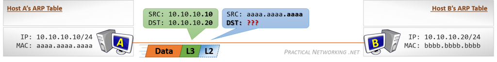

Dato: 09/25/2026

# Host to Host Communication

Illustrasjonen under viser to maskiner uten en ruter i mellom. Kommunikasjon skjer innen dette nettverket.   
Host A og Host B er begge konfigurert med IP-adresser som tilhører det samme nettverket.  

*Figur 1: Host to Host Communication.  Source:(https://www.practicalnetworking.net/series/packet-traveling/host-to-host/)* 

### Steg 1:
Host starter med å generere noe data som skal sendes over til Host B. 
Host A vet hva destinasjons ip-addressen til Host B. 10.10.10.20
Host A vet hva sin Ip-addresse er. 10.10.10.10

Resulatat: Den har muligheten til å Lage en Layer 3 Header med både source og distination Ip-address. 

**NB:** Tidligere lærte jeg at Layer 2 er den som har ansvaret for å levere data/packets fra en enhet til neste hop(neste stop). 

Derfor må det i tilegg til Layer 3 headeren så må det også lages en Layer 2-Header med source MAC og desintation MAC.

Men, akkurat nå så har ikke Host A en oppføring i ARP-Tabellen for Host B sin ip-addresse, og vet derfor ikke MAC-addressen til Host B.

Så akkurat nå så kan ikke Host A lage en Layer 2 Header siden vi ikke har Host B sin MAC-Addresse. 

Host A må sende en ARP request for å finne den manglende MAC-adressen. 

### Steg 2:

**ARP Requesten spør:** *Hvis noen har IP-adressen 10.10.10.20, send meg MAC-adressen din.*

Akkurat nå så vet ikke engang Host A at Host B eksisterer, den vet ikke engang at de er koblet direkte til hverandre. 

ARP Request er sent som en Broadcast. Så denne requesten sendes ut til alle enhetene på dette nettverket.

Host A inkluderer sin egen MAC-adresse i ARP Request. Dette gjør at Host B enkelt kan svare direkte tilbake til Host A med den etterspurte informasjonen.

* Når Host B mottar ARP Request, lærer den at Host A har IP-adressen 10.10.10.10 og MAC-adressen aaaa.aaaa.aaaa. Denne informasjonen legges inn i Host B sin ARP-tabell.
  
* Host B kan bruke denne informasjonen til å svare direkte til Host A. ARP Response sendes som en Unicast-melding direkte til Host A. Hvis det hadde vært andre enheter på nettverket, ville de ikke mottatt ARP Response.
  
* The ARP Response will include the information Host A requested: The IP Address 10.10.10.20 is being served by the NIC with the MAC address bbbb.bbbb.bbbb. Host A will use this information to populate its ARP Table:
  
* Når Host A har fått informasjonen inn i ARP-tabellen, kan den nå lage riktig Layer 2-header og sende pakken til Host B.

Når Host B mottar dataene, kan den svare med en gang fordi den allerede har Host A sin IP → MAC-mapping i ARP-tabellen.
