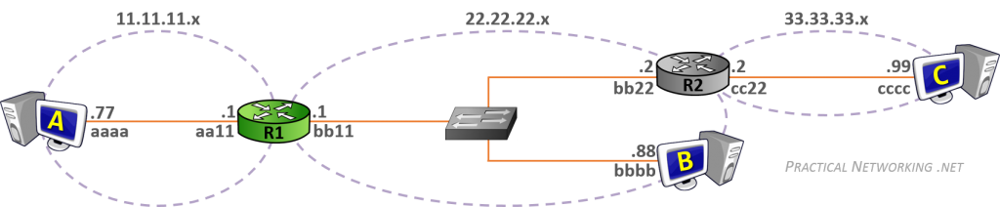

Dato: 09/28/2026

# Host to Host through a Router



*Figur: 1 Host to Host Router. Source[Practicalnetworking](https://www.practicalnetworking.net/series/packet-traveling/host-to-host-through-a-router/)*

- Vi har en ruter R1 og 3 Host maskiner, Host A, B og C.
- MAC Addressene til hvert NIC forkortes til bare fire heksadesimale tegn.

## Router Functions:

En router kobler sammen forskjellige nettverk og sender pakker fra ett nettverk til et annet.

**Eksempel:**  
Nettverk 11.11.11.x
       |
     Host A
       |               **Routeren R1 har altså én side mot 11.11.11.x og én side mot 22.22.22.x.**
      R1
       |
Nettverk 22.22.22.x
       |
     Host B


Host A og Host B er i forskjellige nettverk.  
Host A kan derfor ikke bare sende direkte til Host B. Den må først sende pakken til sin default gateway, som er R1.

For å kunne sende pakker riktig trenger ruteren to tabeller.
- Routing Table
- ARP Table


Routing Table = Hvor skal pakken?
ARP Table = Hvilken MAC-adresse skal jeg sende til?

## Routing Table

Routing Table er som et kart i routeren
Den forteller routeren hvor nettverkene finnes og hvilken vei pakken skal sendes.  

**Eksempel:**
11.11.11.x → venstre interface  
22.22.22.x → høyre interface  
33.33.33.x → via R2  

**Ruteren lærer nettverk på 3 måter:**

**Directly Connected:** Routeren vet automatisk om nettverk som er direkte koblet til den.
**Static Route:** En administrator legger inn ruten manuelt.
**Dynamic Routing:** Routere lærer ruter automatisk fra hverandre.

### Directly Connected

Dette er den enkleste måten routeren lærer et nettverk på.

Hvis en router har et interface direkte koblet til et nettverk, vet routeren automatisk at nettverket finnes der.

11.11.11.x -- R1 -- 22.22.22.x  

Venstre interface: 11.11.11.1
Høyre interface:   22.22.22.1

R1 lærer automatisk at 11.11.11.x er venstre interface og 22.22.22.x er høyre interface.

### Static Route

En Static Route er en rute som administratoren legger inn manuelt.

Administrator kan fortelle R1: «Hvis du skal til 33.33.33.x, send pakken til R2 på 22.22.22.2.»

```text
Nettverk       Hvordan nå det
-----------------------------------------
11.11.11.x     Directly Connected
22.22.22.x     Directly Connected
33.33.33.x     Next-Hop: 22.22.22.2
```
Hvis R1 mottar en pakke til et nettverk som ikke finnes i Routing Table, vet ikke R1 hvor den skal sende pakken.

Da forkaster routeren pakken.

### Dynamic Routing

Her trenger ikke administratoren manuelt fortelle hver router hvor alle nettverkene finnes. Routere kan i stedet kommunisere med hverandre og automatisk informere hverandre om hvilke ruter de kjenner.

Routing Table forteller hvor pakken skal videre, mens ARP Table brukes til å finne MAC-adressen som trengs for å faktisk levere pakken på Layer 2.

## ARP Table

ARP kobler sammen IP-adresser  og MAC-adresser.

IP: 22.22.22.88  
        ↓ ARP  
MAC: bbbb.bbbb.bbbb  

Kobler en IP-adresse til en MAC-adresse, slik at routeren kan levere pakken til riktig nettverkskort.

#### Routing Table og ARP Table gjør forskjellige ting

Routing Table: Hvor skal pakken videre?  
ARP Table: Hvilken MAC-adresse skal jeg sende pakken til?  

ARP Table fylles etter behov og trenger ikke å være fylt påforhånd. 

Eksempen: 

R1 skal sende en pakke til: Host B IP: 22.22.22.88

R1 vet fra Routing Table at Host B befinner seg på et nettverk som er direkte koblet til R1.

Men R1 trenger MAC-adressen til Host B.

R1 sjekker ARP-tabellen:  
22.22.22.88 → ?

Hvis MAC-adressen ikke finnes, sender R1 en ARP Request.

Host B svarer med sin MAC-adresse:  
22.22.22.88 → bbbb.bbbb.bbbb

R1 kan da lagre dette:

```text
**ARP Table**

IP-adresse       MAC-adresse  
22.22.22.88      bbbb.bbbb.bbbb
```

Nå kan R1 lage L2-headeren og sende pakken til riktig NIC.


