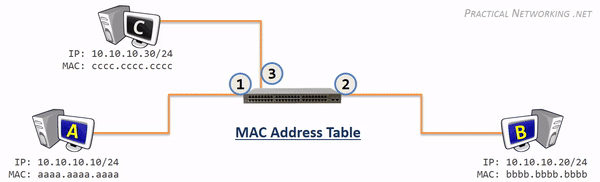

Dato: 09/28/2026

# Host to Host through a Switch

I forrige lærling lærte jeg hva skjer med direkte kommunikasjon fra Host to Host.
Idag skal jeg se hva skjer med kommunikasjon fra Host til Host gjennom en switch.

## Switch funskjoner

En switch har primært 4 fuksjoner:
* Læring:
* Flooding:
* Forwarding:
* Filtering:

### Læring 
En Switch er en Layer 2 enhet, som betyr at den tar alle sine besulutninger basert på informasjonen som ligger i L2-Headeren. 
Den bruker da, Source MAC-Addresse og Destinasjons MAC-Addresse for å ta videre beslutninger.

En switch bruker en MAC-Addresse tabell, som lagrer/kobler switchporter til MAC-addressene til de tilkoblede enhetene.
MAC-Addresse tabellen starter alttid tom. Hver gang en switch mottar noe, ser den på MAC-Addressen i den innkommende Ethernet Ramme.  
Den bruker da Source MAC-Addressen og porten som "Ethernet Framen" ble tatt imot på og lagrer dette i MAC-Addresse Tabellen. 

Etter hvert som hver tilkoblet enhet sender data, vil switchen gradvis bygge opp en komplett MAC-adressetabell.  

### Flooding:  
Det er ikke mulig å unngå at en switch på ett tidspunkt vil motta en Frame, som er adressert til en MAC-adresse som switchen ikke kjenner plasseringen til.  
I slike tilfeller er switchens eneste mulighet å ganske enkelt kopiere denne Framen og sende den ut til alle porter. Denne handlingen kalles **flooding**.

Dette sørger for at hvis den tiltenkte enheten finnes, og hvis den er koblet til switchen så vill den motta rammen. 
Siden denne Framen sendes ut til alle andre enheter som er tilkoblet til Switchen. Så vil selvfølgelig også alle andre enheter som er koblet til den switchen, motta rammen. Selv om dette ikke er ideelt, er det helt normalt.  
Nettverskortet(NIC) til enhver enhet vil da sammenligne destinasjons MAC-Addressen og sammenligner den som er registrert for det Nettverkkortet.  

Hvis den ikke tilhører mottakeren/enheten så vil den forkaste Framen og ikke gjøre noe mer.

Hvis enheten er den tiltenkte mottakeren, kan switchen vite at den klarte å levere rammen.

Når den tiltenkte mottakeren mottar Framen, så vil den generere ett svar. 
Når dette svaret sendes tilbake til switchen, kan switchen lære MAC-adressen og opprette en oppføring i MAC-adressetabellen som kobler den tidligere ukjente enheten til den aktuelle switchporten.  

### Forwarding:  

Ideelt sett så vil switchen ha en oppføring i MAC-adressetabellen for hver destinasjons-MAC-adresse den møter.

Når dette skjer, vil switchen ganske enkelt videresende Framen ut gjennom den riktige switchporten.

**Det finnes tre metoder en switch bruker for å videresende Frames:**

* Store and Forward:
 -  Switchen kopierer hele Framen(Header + Data) inn i en minnebuffer og kontrollerer Framen for feil før den videresendes.
 -  Denne metoden er tregest, men tilbyr best feil deteksjon.
 -  Muliggjør ekstra funksjoner, som å prioritere bestemte trafikk for raskere behandling.

* Cut-Through:
  - Switchen lagrer ingenting, men undersøker bare det som er nødvendig for å lese destinasjons-MAC-adressen og videresende framen.
  - Denne metoden er raskest, men gir ingen feildeteksjon eller mulighet for ekstra funksjoner.

* Fragment Free:
  - Denne metoden er en kombinasjon av de to foregående.
  - Switchen undersøker bare den første delen av rammen (64 byte) før den videresendes. Hvis det har oppstått en overføringsfeil, vil den vanligvis bli oppdaget innenfor de første 64 bytene.
  - Denne metoden gir derfor «god nok» feildeteksjon, samtidig som den er raskere og mer effektiv fordi switchen slipper å lagre hele rammen i minnet før den videresendes.

* **NB:**
- I dag er forskjellen mellom metodene liten, på et tidspunkt var svært viktige, da switch-teknologien var nyere og switching førte til merkbar forsinkelse.
- I dag, med switching i linjehastighet, er forskjellen i hastighet mellom disse tre metodene ubetydelig.
- De fleste moderne switcher bruker Store and Forward.

### Filtering: 

Den siste funksjonen i en Switch er filtering. 
Denne funksjonen betyr hovedsakelig at en switch aldri videresender en ramme tilbake gjennom den samme porten som rammen kom inn på.

Dette skjer vanligvis når en switch må utføre en Flooding. Rammen blir jo da kopierert og sendt ut til alle porter, men ikke fra porten den kom inn fra. 
I sjeldne tilfeller kan en Host sende en Frame med sin egen MAC-adresse som destinasjon. (Dette kan skyldes en feil på verten eller annen unormal oppførsel. I slike tilfeller vil switchen ganske enkelt forkaste rammen.)

## Switch Operasjon: 

Hvordan funker en switch i praksis? 

**Illustrasjon:**

  
*Figur 1: Host to Host communcation through a Switch Source:[Practicalnetworking](https://www.practicalnetworking.net/series/packet-traveling/host-to-host-through-a-switch/)*

https://www.practicalnetworking.net/series/packet-traveling/host-to-host-through-a-switch/
