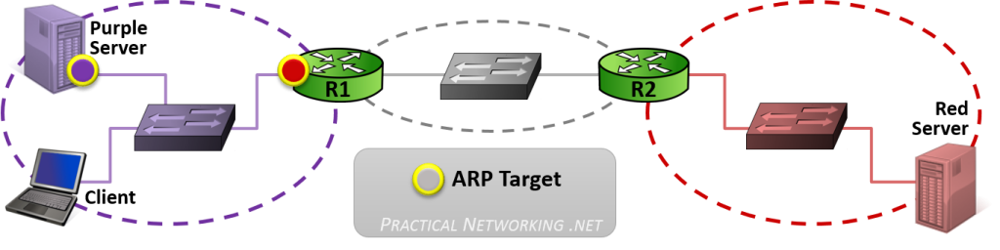

Dato: 09/24/2026

# Key Players

"Key Players" Altså "Viktigste Aktørene" på Internett, og hvilken rolle hver av dem har for å muliggjøre nettverkskommunikasjon.

Det er mange forskjellige elementer som jobber sammen for å skape "Nettverk av Nettverk", som gjør det mulig at milliarder av forskjellige enheter kan kommunisere med hverandre. 

## Noen av de vikgitske aktørene (Ikke komplett liste)

### Host

Begrepet host er en av mest kjente begrepene innen nettverk. Host er en enhet som enten sender eller mottar data over et nettverk.

**Tradisjonelle eksempeler:** Pc eller Datamaskin.
**Moderne eksempler:** Mobiltelefoner, smart-TV-er, smartklokker, enkelte biler og til og med noen kjøleskap og hvitevarer. 

Host'er kjører programvarer og apper som user kan bruke, på ett tidspunkt må en av disse sende ut bits på en kabel.
Hosts opperere på tvers av alle de syv lagene i OSI-modellen. 

I typisk Internett-kommunikasjon eller nettverkstrafikk blir de to vertene som kommuniserer ofte kalt klienten (Client) og serveren (Server).  
* Klienten er enheten som starter forespørselen og ønsker å hente informasjon, data eller en tjeneste.    
* Serveren er enheten som mottar forespørselen og har informasjonen, dataene eller tjenesten som klienten ønsker.

**Forskjellen er at host og client/server beskriver forskjellige ting:**

* Host = en endeenhet som kan sende eller motta nettverkstrafikk.  
* Client = hosten som starter en bestemt forespørsel.  
* Server = hosten som mottar forespørselen og tilbyr tjenesten/dataene.

Men hvis den samme webserveren senere laster ned programvareoppdateringer, fungerer den nå som klient og kommuniserer med en oppdateringsserver.
### Network
Ett nettverk er rett og slett to eller flere enheter som er koblet sammen.

**Et nettverk kan ha mange forskjellige former, for eksempel:**  
* Klasserom: PC-er på samme sted tilhører samme nettverk.  
* Hjem: Laptoper, mobiler og skrivere kan være koblet til samme nettverk.  
* Kafé: Kunder kan koble seg til samme Wi-Fi-nettverk.  
* Bedrift: Kan ha flere nettverk, for eksempel ett for regnskapsførere og ett for ingeniører.

Avhengig av formålet med hvert nettverk kan enhetene i nettverket kommunisere med andre enheter i det samme nettverket eller med enheter i andre nettverk.

### Switch

En switch er en nettverksenhet som hovedsakelig brukes til å legge til rette for kommunikasjon innenfor et nettverk.

Switches opperere i Layer 2 i OSI-modellen, noe som betyr at de ser på informasjonen i lag 2-headeren.
Denne inneholder blant annet kilde- og destinasjons-MAC-adresse, som brukes til å sende data fra én nettverksenhet til den neste (hop til hop).

En switch bruker en MAC-adressetabell for å holde oversikt over hvilke MAC-adresser som er koblet til de ulike portene.

**Switch:**  
* Kobler enheter sammen gjennom porter.  
* Lærer kilde-MAC-adresser og hvilken port de tilhører.  
* Bruker destinasjons-MAC-adressen for å finne riktig port.  
* Hvis destinasjonen er ukjent, sender den framen ut på alle porter (flooding).  

### Router
En router er en nettverksenhet som hovedsakelig brukes til å muliggjøre kommunikasjon mellom nettverk.

* Router opperere i Layer 3 og bruker IP-addresser
* Hvert interface på en router representerer en forbindelse til et nettverk.
* Routeren bruker en routing-tabell for å vite hvilken vei pakken skal sendes.
* Hvis routeren ikke kjenner veien til destinasjonsnettverket, forkastes pakken.

**Routing-tabell**

Dette er en tabell som inneholder veier til alle nettverkene en router vet hvordan den kan nå.   
Disse veiene kalles noen ganger routes, og hver oppføring inneholder et IP-nettverk og enten et interface eller IP-adressen til den neste routeren på veien til målet.

### Address Resolution Protocol (ARP)

*Figure 1: OSI Modell. Source:[Practicalnetworking](https://www.practicalnetworking.net/series/packet-traveling/key-players/)*

Når en klient prøver å kommunisere med en vert på det samme nettverket, vil klienten sende en ARP-forespørsel for å finne MAC-adressen til verten.

*Figur 2:Client to host on same network. Source:[Practicalnetworking](https://www.practicalnetworking.net/series/packet-traveling/key-players/)*

Når en klient prøver å kommunisere med en vert på et annet nettverk, vil klienten sende en ARP-forespørsel for å finne MAC-adressen til standard-gatewayen.

*Figur 3:Client to host on same network. Source:[Practicalnetworking](https://www.practicalnetworking.net/series/packet-traveling/key-players/)*

Fortsette her imrg:

https://www.practicalnetworking.net/series/packet-traveling/key-players/

### Sammendrag
